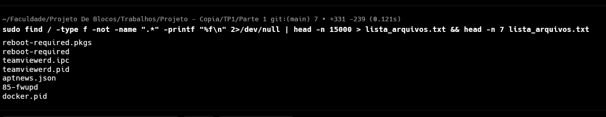

Usei o comando:
```bash
sudo find / -type f -not -name ".*" -printf "%f\n" 2>/dev/null | head -n 15000 > lista_arquivos.txt && head -n 7 lista_arquivos.txt
```

Eu preferi o find pra evitar pastas tb. Fiz alguns filtros bobos, mas como pede "pelo menos 10000" fiz de apenas 15 mil arquivos .

N tem nada magico é bem simples